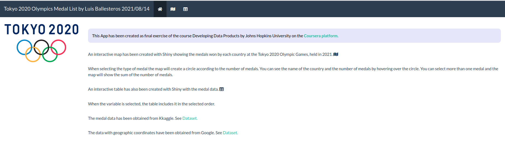
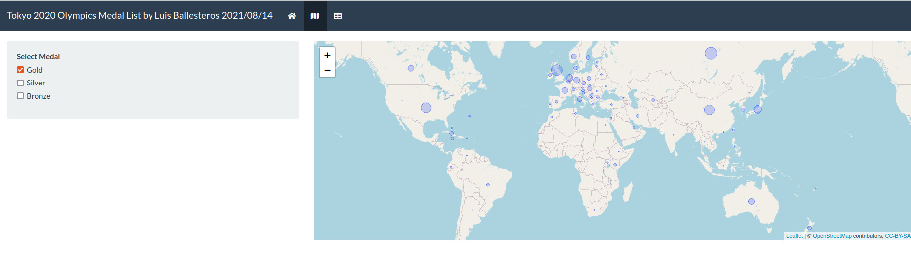

# Tokyo 2020 medals

## Developing Data Products: Course Project
### Introduction and Overview
This presentation and the associated Shiny app conclude the Coursera course: Developing Data products. See https://www.coursera.org/learn/data-products

Included in this project are:

- a Shiny app hosted on shinyapp.io. See https://www.coursera.org/learn/data-products
- a presentation, providing an overview, code examples and link. See https://rpubs.com/luisballesteros/tokyo_2020_presentation
- the corresponding source code hosted via github. See https://github.com/luisballesteros/tokyo_2020/


### UI Examples




### ui.R
```
library(shiny)
library(shinythemes)
library(leaflet)

ui <- navbarPage(theme = shinytheme("flatly"),
                 "Tokyo 2020 Olympics Medal List by Luis Ballesteros 2021/08/14",
                 
                 tabPanel(icon("home"),
                          fluidRow(column(tags$img(src="Summer_Olympics_tokyo_2020.png",
                                                   width="275px",
                                                   align = "center"),width=2),
                                   column(
                                       
                                       br(),
                                       p("This App has been created as final exercise of the course Developing Data Products by Johns Hopkins University on the  ", a(href="https://www.coursera.org/learn/data-products/home/welcome/", strong("Coursera platform.")),
                                         style="text-align:justify;color:black;background-color:lavender;padding:15px;border-radius:10px"),
                                       br(),
                                       p("An interactive map has been created with Shiny showing the medals won by each country at the Tokyo 2020 Olympic Games, held in 2021. ", icon("map")),
                                       br(),
                                       p("When selecting the type of medal the map will create a circle according to the number of medals. You can see the name of the country and the number of medals by hovering over the circle. You can select more than one medal and the map will show the sum of the number of medals."),
                                       br(),
                                       p("An interactive table has also been created with Shiny with the medal data. ", icon("table")),
                                       br(),
                                       p("When the variable is selected, the table includes it in the selected order."),
                                       br(),
                                       p("The medal data has been obtained from Kkaggle. See ", a(href="https://www.kaggle.com/berkayalan/2021-olympics-medals-in-tokyo", "Dataset.")),
                                       br(),
                                       p("The data with geographic coordinates have been obtained from Google. See ", a(href="https://developers.google.com/public-data/docs/canonical/countries_csv", "Dataset.")),
                                       width=10)))
                          ,
                 
                 # Panel title
                 tabPanel(icon("map"),
                          
                          # Sidebar with a slider input for number of bins 
                          sidebarLayout(
                              sidebarPanel(
                                  checkboxGroupInput("select_medal", 
                                                     "Select Medal", 
                                                     choices = list("Gold" = "Gold", 
                                                                    "Silver" = "Silver",
                                                                    "Bronze" = "Bronze")
                                  ),
                              ),
                              
                              # Show a plot of the generated distribution
                              mainPanel(
                                  leafletOutput("mymap")
                              )))
                 
                 ,
                 tabPanel(icon("table"),
                          sidebarLayout(
                              sidebarPanel(
                                  
                                  selectInput(
                                      inputId = "variables",
                                      label = "Select the variables",
                                      choices = c("Country",
                                                  "Gold",
                                                  "Silver",
                                                  "Bronze",
                                                  "Total",
                                                  "Rank",
                                                  "cod_contry",
                                                  "lat",
                                                  "lng"),
                                      selected = "",
                                      multiple = TRUE
                                  )
                              ),
                              
                              # Show a plot of the generated distribution
                              mainPanel(
                                  dataTableOutput("country_medals")
                              )
                          ))
)

```


### server.R
```
library(shiny)
library(leaflet)
library(tidyverse)
library(htmltab)
library(dplyr)
library(stringr)
library(plyr)

Tokyo_2020 <- read_csv("Tokyo_Medals_2021.csv")
Tokyo_2020 <- Tokyo_2020 %>% 
    dplyr::rename(Gold = "Gold Medal",
                  Silver = "Silver Medal",
                  Bronze = "Bronze Medal",
                  Rank = "Rank By Total")
str(Tokyo_2020)
# importamos tabla de google con las paises y sus coordenadas geográficas 
link <- "https://developers.google.com/public-data/docs/canonical/countries_csv"
countries_coor <- htmltab(link)
# we rename variables for convenience
countries_coor <- countries_coor %>%
    dplyr::rename(cod_contry = country,
                  Country = name,
                  lng= longitude,
                  lat= latitude)

# str(countries_coor)
# we change country names in the medal table to match the country names in
# the geographic coordinates table.
# "Chinese Taipei" -> Taiwan
# https://es.wikipedia.org/wiki/China_Taipéi_en_los_Juegos_Olímpicos
# "ROC" -> Russia
# https://en.wikipedia.org/wiki/Russian_Olympic_Committee_athletes_at_the_2020_Summer_Olympics
error_country <- c("United States of America",
                   "People's Republic of China",
                   "Great Britain",
                   "ROC",
                   "Republic of Korea",
                   "Islamic Republic of Iran",
                   "Chinese Taipei",
                   "Hong Kong, China",
                   "North Macedonia",
                   "Republic of Moldova",
                   "Syrian Arab Republic")
correct_country <- c("United States", 
                     "China", 
                     "United Kingdom",
                     "Russia",
                     "South Korea",
                     "Iran",
                     "Taiwan",
                     "Hong Kong",
                     "Macedonia [FYROM]",
                     "Moldova",
                     "Syria")

Tokyo_2020$Country <- mapvalues(Tokyo_2020$Country, 
                                from= error_country, 
                                to = correct_country)

# we join to the medals table the records that match by Country in the 
# coordinates table
country_medals <- Tokyo_2020 %>% left_join(countries_coor, by = "Country")
### check error in join
# error_country <- country_medals %>% filter(is.na(latitude)) %>% 
#select(Country) %>% list()
# error_country

# change latitude and longitude to numeric
country_medals$lat <- as.numeric(country_medals$lat)
country_medals$lng <- as.numeric(country_medals$lng)
# str(country_medals)
country_medals_wide <- country_medals
# convert to long format
country_medals <- country_medals %>%
    pivot_longer(cols = (Gold:Bronze),
                 names_to = "Type_Medal",
                 values_to = "Number_Medals")
str(country_medals)


# Define server logic required to draw a histogram
shinyServer(function(input, output) {
    country_medals_filter <- reactive({country_medals %>%
            filter((Number_Medals > 0) & (Type_Medal %in% input$select_medal)) %>%
            dplyr::group_by(Country, lat, lng) %>% 
            dplyr::summarise(Medals = sum(Number_Medals))
        
    })
    
    output$mymap <- renderLeaflet({
        country_medals_filter <- country_medals %>%
            filter((Number_Medals > 0) & (Type_Medal %in% input$select_medal)) %>%
            dplyr::group_by(Country, lat, lng) %>% 
            dplyr::summarise(Medals = sum(Number_Medals))
        
        country_medals_filter %>%
            leaflet() %>%
            addTiles() %>%
            addCircles(weight =1,
                       radius = sqrt(country_medals_filter$Medals)*5*10^4,
                       label=~stringr::str_c(Country, ' ',
                                             formatC(Medals,
                                                     format='d')))
        })

    output$country_medals <- renderDataTable({
        select(country_medals_wide, input$variables)
        
        })

})

```
